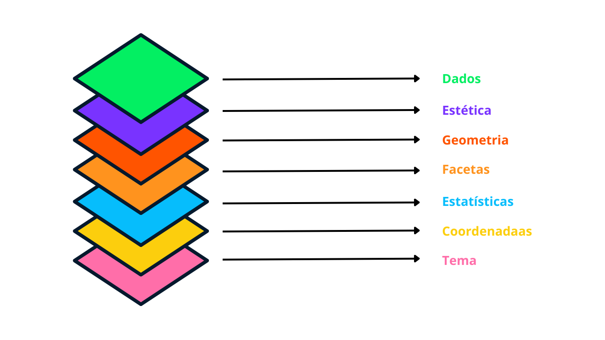

```{r pacotes, include=FALSE}
knitr::opts_chunk$set(echo = TRUE, out.width = '100%')
library(tidyverse)
```

# O que é *ggplot2*?

O `ggplot2` é um pacote criado na liguagem R que tem como objetivo criar, editar e modificar gráficos de alta qualidade, facilitando a interpretação de resultados de coletas de dados e extração de *insights* acerca dos dados.

# Introdução

A ideia principal do `ggplot2` é construir, camada por camada, o gráfico desejado, baseado nas informações disponíveis. As camadas desde pacote podem ser descritas conforme a Figura 1.


Descrevendo sucintamente cada uma delas, temos o seguinte:

* **Dados (*data*)**: Fonte das informações utilizadas no gráfico, usualmente representado por um objeto da classe `data.frame` ou `tibble`;
* **Estética (*aesthetics*)**: 
* **Geometria (*geometries*)**: O tipo de gráfico que será criado (Ex: barras, colunas, pizza, box-plot, histograma, etc.);
* **Facetas (*facets*)**: Informado quando o usuário precisa ilustrar uma grande com mais de um gráfico, de acordo com diferentes critérios;
* **Estatísticas (*statistics*)**: Estatísticas importantes (Ex: média, mediana, desvio padrão, etc.) que podem ser incluídas através de elementos gráficos;
* **Coordenadas (*coordinates*)**:
* **Tema (*theme*)**: Controla a aparência geral do gráfico. O `ggplot2` já possui um tema padrão e algumas alternativas de escolha. No entanto, um novo tema pode ser criado ou algum tema existente pode ser alterado.

Cada elemento gráfico é especificado individualmente, e a combinação de todos eles resulta do gráfico desejado. Vamos entender como funciona o processo.

# Entendendo as camadas do `ggplot2`

Para entender o processo da construção de gráficos, vamos considerar apenas as três primeiras camadas: `data`, `aesthetics` e `geometries`.

Considerando a base dados `mtcars`, usualmente utilizada em diversos exemplos, temos os dados abaixo:

```{r mtcars1}
head(mtcars)
```

Suponha que estejamos interessados na variável `hp`, potência em cavalos, e que para investigá-la, inicialmente vamos construir um histograma. Nossas três camadas serão as seguintes:

* **`data`**: a base de dados `mtcars`;
* **`aesthetics`**: o eixo do histograma. No caso, será o eixo X;
* **`geometries`**: especificar que desejamos contruir um histograma.

Portanto, em código R, temos o seguinte:

```{r exemplo_1}
ggplot(mtcars, aes(x = hp)) +
  geom_histogram()
```

Note que as demais camadas não foram especificadas. Mas não significa necessariamente que elas não existam. Sobre elas, temos o seguinte:

* **`facets`**: por padrão, apenas um gráfico é gerado. Como não houve especificação, aplicou-se o padrão;
* **`statistics`**: não se aplicou, visto que não foram incluídas estatísticas no gráfico;
* **`coordinates`**: utilizou-se as coordenadas padrão, considerando o eixo X. Mas existe a opção de inverter as coordenadas;
* **`theme`**: não foi especificado, mas o tema padrão do `ggplot2` foi utilizado;