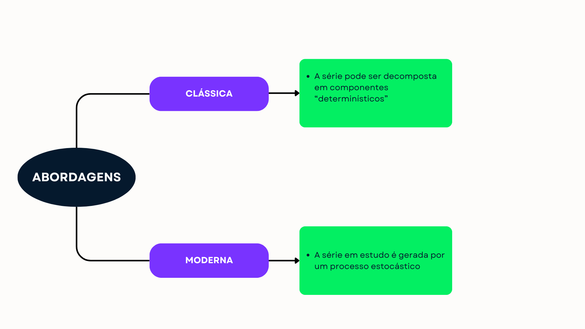

```{r setup, include=FALSE}
knitr::opts_chunk$set(echo = TRUE, language = "r", fig.align = 'center')
```

# Considerações Iniciais

## Objetivos

Essa página tem como objetivo apresentar os principais conceitos, ideias e aplicações sobre o conteúdo de Séries Temporais de maneira simples e acessível. Cada conceito será usualmente acompanhado por exemplos de aplicação e no software R.

Embora feito com bastante critério, este material provavelmente não está isento de erros e será periodicamente atualizado. Em caso de dúvidas ou sugestões, favor entrar em contato com: prof.filipeformiga@gmail.com. Qualquer dúvida ou crítica construtiva será bem vinda!

Dito isso, o primeiro passo para que se possa acompanhar este material é através da instalação e utilização dos pacotes `fpp2` e `tidyverse`, conforme abaixo:

```{r packages, message=FALSE, warning = FALSE}
library(tidyverse)
library(fpp2)
```

Caso seja necessário o carregamento de outros pacotes, o faremos no decorrer do texto, mas os dois acima são essenciais em praticamente todos os tópicos deste material. O conteúdo dessa página pode ser resumido da seguinte maneira: \

**Introdução:** serão apresentados os conceitos básicos, motivação e exemplos de séries temporais que servirão como pilares para os próximos tópicos.

**Modelos de Suavização Exponencial:** neste tópico será abordada a decomposição de séries temporais (tendência e sazonalidade) segundo essa abordagem; métodos de estimação de tendência e sazonalidade, e ainda serão apresentados os modelos de Médias Móveis (MM) e Suavizações Exponenciais Simples (SES), de Holt (SEH) e Holt-Winters (HW).

**Modelos de Box-Jenkins:** metodologias baseadas nos modelos probabilísticos de Box-Jenkins, onde serão apresentados modelos para séries estacionárias (AR, MA e ARMA), séries com tendência (ARIMA), sazonalidade (SARMA) e para séries com tendência e sazonalidade (SARIMA).

## Principais Referências

Este material consiste em um compilado de duas principais referências, como segue:

* ***Forecasting, Principles and Pratice***, escrito por Rob J. Hyndman e George Athanasopoulos: este livro está disponível como página da web, e por ser acessado através do link: https://otexts.com/fpp3/.
* ***Análise de Séries Temporais: Modelos Univariados***: abrange grande parte do material teórico disponibilizado. O livro pode ser adquirido em: .

O conteúdo será atualizado semanalmente, e à medida que novos materiais forem utilizados, estes serão adicionados à lista acima.

# Introdução

## Conceitos básicos e notação

Como o próprio nome já descreve, uma série temporal é **qualquer conjunto de observações ordenadas no tempo**. São exemplos de séries temporais:

* médias diárias de temperatura em determinada cidade;
* índices diários da bolsa de valores (IBOVESPA);
* valores diários da cotação do dólar;
* registro de marés no porto de Santos;
* número mensal de passageiros de determinada companhia aérea;
* dentre outros exemplos.

Perceba que se olharmos, por exemplo, para a média diária de temperatura de determinada cidade temos um valor específico para a temperatura (denotado por $Z$) para cada período de tempo ($t$), que estão sendo contabilizado em dias. Este é um caso em que temos uma série em intervalos **discretos**, pois temos um valor da variável de interesse em pontos bem definidos.

Já o caso do registro de marés no porto de Santos se trata de uma variável em intervalos **contínuos**, pois essa característica é medida em um intervalo contínuo sendo composto por infinitos valores. Para medir o tempo em séries contínuas usualmente tomam-se intervalos $\Delta t$ de tempo e se faz uma "discretização" da série para que intervalos bem definidos sejam utilizados. Esse procedimento é usualmente utilizado porque além de simplificar e organizar a informação contida na série, não acarreta em perdas de acurácia ou precisão na análise.

Séries temporais são inicialmente identificadas e observadas através de um gráfico de linhas, em que no eixo $X$ dispomos do tempo ($t$) enquanto no eixo $Y$ podemos observar a nossa variável de interesse ($Z$).

Para iniciarmos o conhecimento sobre a notação, considere o seguinte exemplo, carregando o pacote `fpp2` e a base de dados `elecsales`. Essa série se refere às vendas anuais de eletricidade para a Austrália do Sul, em GWh, entre os anos de 1989 e 2008.

```{r elec1}
elecsales
```

Aqui, podemos definir alguns conceitos importantes, como:

* $Z_t$: é a t-ésima observação ($t = 1, ... , T$) da variável de interesse $Z$, já descrita anteriormente. Para o exemplo, $Z_{1} = 2354,34; ...; Z_{20} = 3655,00$;
* $t$: é o índice da observação da variável $Z$. Exemplo: $Z_1$ denota a primeira observação de $Z$; $Z_2$ é a segunda observação, e assim por diante ($t=1,..., T$);
* $T$: tamanho da amostra, sendo para este caso, $T=20$. Sempre observar a diferença entre o índice $t$ e o total amostral $T$;
* **Período**: é a frequência das observações da série em estudo. Neste caso, como temos uma observação por ano, **o período é anual**;
* $Z_1$, na notação do exemplo, representa o valor da variável $Z$ no período 1, que neste caso se refere ao ano de $1989$, e assim por diante.

Note que precisamos inicialmente identificar o que estamos estudando (variável $Z$), o período (no exemplo, em anos) e o tamanho amostral. Essa informação pode parecer óbvia, mas a interpretação até mesmo de modelos avançados de séries temporais dependem do conhecimento desses elementos básicos. O período pode se apresentar em anos, meses, trimestres, semestres ou em unidades de tempo menores como horas, minutos, segundos etc.

Para visualizar uma série temporal podemos utilizar a função `autoplot`, do pacote `fpp2` e adicionar alguns elementos do `fpp2`, já que essa função é baseada neste pacote.

```{r gg1}
autoplot(elecsales, colour = 'deepskyblue', size = 2,
         xlab = 'Ano', ylab = 'Energia vendida (GWh)') +
  theme_classic()
```

Dentre alguns argumentos importantes dessa função, temos:

* `colour`: define a cor utilizada na linha. Uma quantidade considerável de opções de cores pode ser acessada [clicando aqui](http://www.stat.columbia.edu/~tzheng/files/Rcolor.pdf);
* `size`: determina a largura da linha;
* `xlab` e `ylab`: títulos dos eixos;
* `theme_classic()`: altera o tema utilizado. Acesse a [biblioteca do ggplot2](https://ggplot2.tidyverse.org/reference/ggtheme.html) para encontrar diferentes temas, caso seja necessário.

Para mais detalhes sobre a função `autoplot`, acesse a [documentação da função](https://www.rdocumentation.org/packages/survMisc/versions/0.4.2/topics/autoplot).

A função `autoplot` detecta o tipo do objeto em que se deseja extrair o gráfico e realiza a operação da maneira que julga adequada. A Figura acima, por exemplo, resulta em um gráfico de série temporal por conta do tipo do objeto `elecsales`:

```{r electipo}
class(elecsales)
```

Por padrão, a classe do R utilizada para denotar séries temporais é dada acima (`ts`, representando a abreviação de *time series*). Outros tipos serão utilizados posteriormente para trabalhar com esse tipo de análise, mas por hora vamos nos concentrar nos objetos da classe `ts`.

## Objetivos e motivação

Ao coletar e observar os dados no tempo de determinada série $Z_{t}=Z_{1}, ..., Z_{T}$, o pesquisador pode estar em:

* fazer previsões de valores futuros da série;
* descrever o comportamento da série;
* procurar periodicidades relevantes nos dados;
* investigar o mecanismo gerador da série;
* entre outros.

Existem inúmeros métodos (conhecidos ou não) para atingir os objetivos acima, e a maioria deles são baseados na construção de **modelos probabilísticos** que ao serem criados, usualmente são capazes de descrever o comportamento de uma série temporal. Para entender melhor sobre estes modelos, as próximas 3 sessões auxiliam no aprendizado de conceitos básicos que serão úteis para a construção desse modelo.

**É muito importante que todas elas sejam estudadas e entendidas antes de ir para as próximas etapas**, já que são praticamente um dicionário dos termos que serão utilizados de agora em diante.

## Abordagens de uma série temporal

Para facilitar o entendimento do nosso estudo, vamos inicialmente dividir a análise de séries temporais em duas principais abordagens, a **clássica** e a **moderna** (Figura 2).



Em ambas as abordagens, existem métodos capazes de descrever de maneira satisfatória o comportamento dos dados em estudo, bem como de fazer boas previsões para o futuro.

### Abordagem clássica

Na abordagem clássica (ou ``determinística''), a série temporal pode ser interpretada por uma soma (modelos aditivos) ou produto (modelos multiplicativos) dos seus **componentes**. Por hora, os componentes de uma série temporal neste caso serão:

* **Tendência ($T_t$):** quando a série apresenta um crescimento ou decrescimento de acordo com o tempo, podendo seguir diferentes padrões;
* **Sazonalidade ($S_t$):** consiste na série apresentar um comportamento semelhante em determinados períodos regulares. Esses pedíodos podem ser semanais, trimestrais, mensais etc;
* **Ruído (ou erro) ($a_t$):** parte residual, apresentando a variação aleatória da série.

Sendo assim, cada observação da série, $Z_t$, será composta por:

* Segundo o **modelo aditivo**:

$$Z_t = T_t + S_t + a_t$$

* Segundo o **modelo multiplicativo**:

$$Z_t = T_t . S_t . a_t$$

Na prática, os métodos consistem na estimação individual de cada termo presente nas equações, e a soma ou produto destes resulta em cada valor observado.

Considere, inicialmente, a série temporal `AirPassengers`, que faz parte da base de dados do R:

```{r airp}
autoplot(AirPassengers, size = 1,
         xlab = 'Mês / Ano', ylab = 'Passageiros') +
  theme_classic()
```

Para ilustração dos conceitos discutidos, vamos **decompor essa série** nos seus respectivos componentes, o que pode ser visualizado através dos modelos:

* **Aditivo:**

```{r airp_ad}
autoplot(decompose(AirPassengers,
                   type = c('additive'))) +
  theme_classic() +
  labs(title = 'Decomposição: modelo aditivo')
```

* **Multiplicativo:**

```{r airp_mult}
autoplot(decompose(AirPassengers,
                   type = c('multiplicative'))) +
  theme_classic() +
  labs(title = 'Decomposição: modelo multiplicativo')
```

Como se pode observar, cada componente em cada ponto é estimado e utilizado para ``construção'' de cada observação $Z_t$. Os principais métodos dessa abordagem são os **Métodos de Suavização Exponencial**, que futuramente serão discutidos.

### Abordagem moderna

Na abordagem moderna (ou ``estocástica''), consideraremos que cada série temporal observada é gerada por um **processo estocástico**. Isso significa que existe um ou mais **modelos probabilísticos** capazes de descrever este processo. Sendo assim, o principal objetivo das suas metodologias relacionadas é **identificar estes modelos**, de modo que quando a tarefa é realizada com sucesso, adquirimos a possibilidade de realizar projeções e fazer inferências acerca do futuro da série em estudo.

Para entender melhor a ideia, observe a seguinte Figura:

```{r procest, echo = FALSE}
RW = function(N, x0, mu, variance) {
  z = cumsum(rnorm(n = N, mean = 0, sd = sqrt(variance)))
  t = 1:N
  x = x0 + t * mu + z
  return(x)
  }
# mu is the drift

set.seed(11)

S1 = RW(100,10,0,0.0004)
S2 = RW(100,10,0,0.0004)
S3 = RW(100,10,0,0.0004)
S4 = RW(100,10,0,0.0004)

df1 = data.frame(t = c(1:100), S1, S2, S3, S4)
df1 = df1 %>%
  mutate(S5 = rowMeans(df1 %>% select(S1:S4)))

df1 %>% pivot_longer(S1:S5, names_to = 'Série', values_to = 'Z') %>%
  ggplot(aes(x = t, y = Z, color = Série)) + geom_line(linewidth = 2) +
  labs(x = 't', y = 'Z', color = '') +
  scale_color_manual(values = c('#03ef62', '#7933ff', '#ff931e','#06bdfc', '#05192d')) + 
  theme_classic() +
  theme(legend.position = 'top')
```

De modo simplificado, as séries `S1` (verde), `S2` (roxo), `S3` (laranja) e `S4` (azul) representam 4 caminhos possíveis para esse processo estocástico, enquanto `S5` (azul escuro) mostra a **média** desses processos. As séries foram observadas no intervalo dos inteiros de 1 a 100. Nessa circunstância, um mesmo processo estocástico foi responsável por gerar as 4 primeiras séries, ressaltando a natureza probabilística do nosso problema. Já a última série neste exemplo representa a **função média** $\mu(t) = E[Z(t)]$ dos processos observados. Na prática, nosso objetivo consiste em estimar uma função média capaz de modelar a série observada para seu comportamento seja corretamente identificado, e consequentemente, previsões acuradas possam ser feitas.

Os métodos abordados futuramente para este objetivo serão os modelos de Box-Jenkins, também conhecidos como **Modelos ARIMA**.

## Autocorrelação e defasagem

Uma das principais formas de descrever uma série temporal além da análise gráfica já apresentada é através da análise da **correlação que a série possui com ela mesma, defasada em $k$ períodos**. Este conceito é a ideia principal da **autocorrelação**, pois para entender o comportamento da série de modo que fiquemos possibilitados de fazer projeções futuras, é interessante ententermos primeiramente a relação que a série possui com ela mesmo no passado. Esse intervalo relacionado ao passado ou ao futuro da série temporal em estudo também é conhecido como **defasagem**, ou ***lag***. A defasagem, como já dito, será denotada por $k$. Segue alguns exemplos da nossa terminologia:

* $Z_{t-1}$ representa a série $Z_t$ defasada em $1$ período;
* $Z_{t-2}$ representa a série $Z_t$ defasada em $2$ períodos;

e, de maneira geral:

* $Z_{t-k}$ representa a série $Z_t$ defasada em $k$ períodos.

Para cada defasagem $k$, existe uma autocorrelação, estimada por $r_k$. O conjunto de todos os pares $(k, r_k)$ forma o que chamamos de **Função de Autocorrelação (fac)** de $Z$.

Antes de adentrar no cálculo das autocorrelações, vamos observar um exemplo. Considere a série `livestock`, do pacote `fpp2`. Essa série representa o número **anual** de rebanhos ovinos na Ásia (em milhões de cabeças), variando entre 1961 e 2007.

```{r livestock1}
livestock
autoplot(livestock, size = 1,
         xlab = 'Ano',
         ylab = 'Número de rebanhos') +
  theme_classic()
```

Para calcular e entender a função de autocorrelação no R e apenas para título do nosso entendimento, vamos considerar as 10 primeiras autocorrelações e defasagens. Temos, portanto a seguinte opção:

```{r livestock1_fac}
data.frame(defasagem = Acf(livestock, plot = FALSE)$lag[1:10],
           correlacao = round(Acf(livestock, plot = FALSE)$acf[1:10], 2))
```

A saída acima é composta por duas colunas: a primeira representa a defasagem $k$, e a segunda, a autocorrelação estimada correspondente $r_k$. Podemos interpretar da seguinte maneira:

* Para a defasagem $0$ ($k = 0$), a autocorrelação é igual a $1$ ($r_0 = 1$) porque ao estabelecer $k=0$, estamos calculando a correlação entre $Z_t$ e ela mesma, ou seja, $Cor(Z_t, Z_t)$. Sendo assim, a correlação de uma variável com ela mesmo sempre será igual a $1$;
* Para a defasagem $1$ ($k=1$), a autocorrelação é igual a $0,92$ ($r_1 = 0,92$), ou seja, $Cov(Z_t, Z_{t-1}) = 0,92$;
* Para a defasagem $2$ ($k=2$), a autocorrelação é igual a $0,84$ ($r_2 = 0,84$), ou seja, $Cov(Z_t, Z_{t-2}) = 0,84$;

e assim por diante.

Vamos agora considerar todas as defasagens $0, 1, ..., 46$ (OBS: a defasagem varia entre $0$ e $T-1$, sendo T o tamanho da série temporal em estudo. Como a série possui $47$ observações, as defasagens vão de $0$ a $46$).

```{r livestock1_acf}
Acf(livestock, main = '')
```

O gráfico acima representa a função de autocorrelação da série `livestock`, onde no eixo $X$ (horizontal) podemos observar as defasagens, ou *lags* (coluna `defasagem` da saída anterior do R), enquanti as linhas verticais representam a autocorrelação para cada defasagem (coluna `correlacao` da saída anterior do R). Sobre esse tipo de gráfico como um todo, temos algumas considerações:

* Mesmo que a autocorrelação seja elevada para as primeiras defasagens, a tendência é que ela tenda a diminuir com o tempo, de maneira acentuada ou não;
* Quanto maior a autocorrelação (mais próxima de $1$ em módulo), maior a dependência temporal da série;
* Autocorrelações fora da linha tracejada azul podem ser consideradas significativas, enquanto autocorrelações dentro desse intervalo são consideradas irrelevantes.

Outros termos e definições importantes serão acrescentados de acordo com o andamento da escrita deste material, mas até o momento, o que foi apresentado se trata de uma introdução às Séries Temporais, as principais abordagens e métodos descritivos que nos auxiliam na **análise descritiva** da série em estudo, bem como aplicações em linguagem R. A próxima seção terá como objetivo um maior aprofundamento sobre os componentes de uma série temporal: a Tendência e a Sazonalidade.